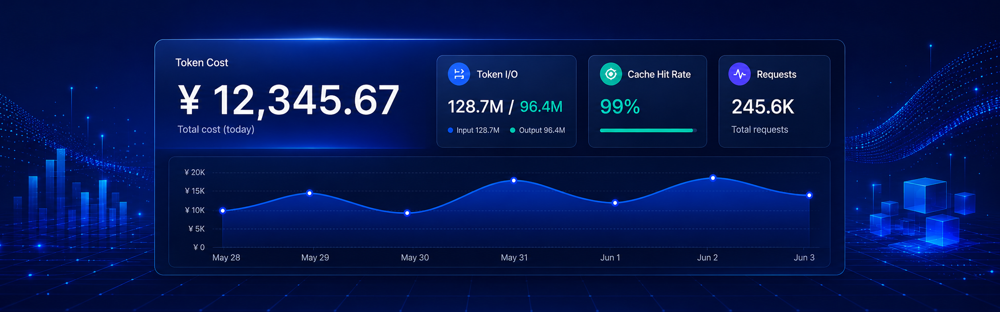
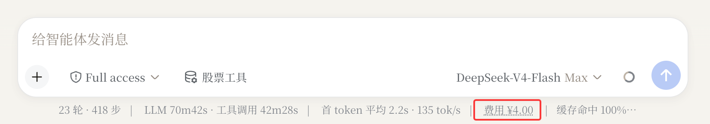
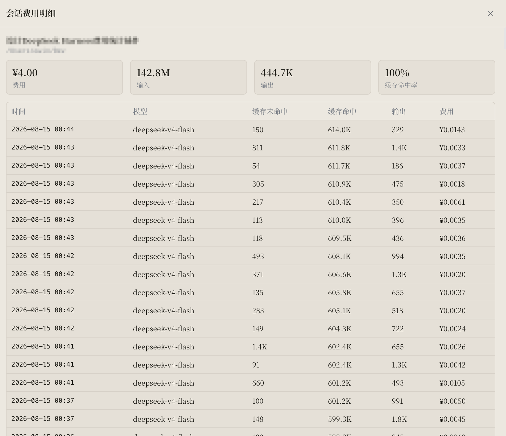

# dsh-token-cost

<p align="center">
  
</p>

<p align="center">
  <a href="README.en.md">English</a> · <strong>中文</strong>
</p>

DeepSeek Harness（DSH）Web GUI 的 Token 用量 / 缓存命中 / 费用统计插件：支持单对话视图与整体汇总，内置双计价方案并在 DeepSeek 调价后按记录时间自动切换。

## 功能

- **单对话视图**：对话页面底部官方状态行（「首 token 平均 … · … tok/s」之后）直接嵌入本会话消耗费用，点击即可打开按请求的明细弹窗（时间 / 模型 / 缓存未命中 / 缓存命中 / 输出 / 费用，最新在上）。

<p align="center">
  
</p>

<p align="center">
  
</p>

- **账户余额**：同一状态行上，费用旁边并排显示当前 provider 的账户余额（如「余额 ¥41.82」），每 5 分钟自动刷新，点击可手动刷新；查询失败或提供商不支持时显示对应状态文案。
- **对话区全宽**：可强制对话区撑满窗口宽度（覆盖 DSH 内置宽度变量，DSH 升级后依然生效），也可切回 DSH 默认宽度。

- **整体汇总**（设置 > 插件配置 > Web UI 插件 > Token 费用统计）：时间筛选（今天 / 昨天 / 最近 7 天 / 最近 30 天 / 本月 / 上月 / 自定义，最多 30 天）+ 费用 / 输入 / 输出 / 缓存命中率统计卡，按模型、会话、日期分组。
- **计价状态**：当前生效方案、下次切换时间、高峰时段一目了然。

## 数据来源

插件读取 DSH 的持久会话日志（`$DSH_HOME/sessions/<cwd>/<session-id>/session.jsonl.zstd`），把 provider 上报的 usage 事件折叠为按请求的计费记录（同一 turn/step 取最后一次，与官方 token-meter 投影语义一致）。紧凑账本（`$DSH_HOME/storages/dsh-token-cost/ledger.json`）缓存解析结果，只重解析变化的日志；zstd 解压使用 fzstd（纯 JS 零依赖）。

Token 字段遵循 Harness 约定：`inputTokens` = 缓存未命中部分，`cacheReadTokens` = 缓存命中部分（两者不相交，相加即计费输入）。

**账户余额**：由 host 进程解析当前 provider 的凭据引用并经 `credentials` 服务取密钥（密钥不出 host 进程），调用 `GET https://api.deepseek.com/user/balance`（仅 `deepseek-official` 支持），经 `/api/dsh-token-cost/balance` 同源下发。

## 价格引擎（双方案 + 自动切换）

内置官方价格表（api-docs.deepseek.com/quick_start/pricing，2026-08-14 抓取）：

- **方案 A**（平价，2026-08-16T16:00Z 前）：deepseek-v4-flash / v4-pro 平价（CNY/USD），deepseek-chat / deepseek-reasoner 旧平价。
- **方案 B**（峰谷定价，2026-08-16T16:00Z = 北京时间 2026-08-17 00:00 起）：高峰时段北京时间 9–12、14–18（UTC 1–4、6–10），闲时半价；v4 两模型适用，旧模型维持平价。

每条记录按时间取「生效时间最晚且不晚于记录时间」的方案计费。**将来 DeepSeek 再次调价，只需追加一条新方案，无需更新插件。** 也支持强制方案（`priceMode`）、自定义模型价格（`customPrices` JSON）与显示币种切换（CNY/USD）。

费用 = 未命中/1e6 × 未命中单价 + 命中/1e6 × 命中单价 + 输出/1e6 × 输出单价（每百万 tokens 单价）。

> 说明：金额为基于 provider 上报用量的估算，请以官方账单为准。按日期分组跟随浏览器时区，跨零点对话按本地日期切分；使用同一把 API Key 但在 DSH 之外发起的请求（其他工具/进程）不产生会话日志，不在统计范围内。

## 安装

```sh
dsh plugin --profile web add github:le-soleil-se-couche/dsh-token-cost
```

重启 `dsh web` 后，在设置页展开「Web UI 插件」即可看到。历史会话日志在首次查询时自动回填。

## 更新

本地开发（`link:` 方式安装）时，改代码后按改动范围生效：

```sh
cd <插件目录>
pnpm build        # 重新生成 lib/
```

- **界面改动**（余额、宽度、卡片等）：DSH 内置 client-hmr 自动热更新浏览器，未生效就刷新页面。
- **host 改动**（路由、设置项）：重启 `dsh web`。
- **改了 package.json**（新增/变更依赖）：先 `pnpm install`，再重新 `dsh plugin --profile web add <插件目录>`，然后重启 `dsh web`。
- **从 git 拉新版本**：`git pull` → `pnpm install` → `pnpm build` → 重新 `dsh plugin --profile web add <插件目录>`。

从远程安装的包（npm / github）更新方式见 DSH 官方插件文档（`dsh plugin --profile web update <包名>` 或重装到新版本）。

## 与上游的差异

本仓库 fork 自 [le-soleil-se-couche/dsh-token-cost](https://github.com/le-soleil-se-couche/dsh-token-cost)（`9a7c183`），相对上游的修改：

- **账户余额**：新增 `/api/dsh-token-cost/balance` 路由与状态行余额 chip（5 分钟自动刷新、点击手动刷新），密钥经 `credentials` 服务在 host 进程内解析，不出进程
- **对话区全宽**：新增 `chatWidth` 配置项，覆盖 DSH 内置宽度变量（升级不回退）
- **Windows 路径兼容**：`ledger.ts` 中 `split('/')` 与 `lastIndexOf('/')` 只认正斜杠，已改为兼容 `\`——修复 Windows 下会话 id 全部变成 `session-unknown`、ledger.json 持久化失败（`mkdir ''`）两个问题
- **DSH rc.6 槽名适配**：设置页卡片槽 `web-ui.plugin.item` → `settings.plugin.item`（原槽名在 rc.6 下注册静默失效，卡片不显示）
- **测试**：ledger 测试适配 Windows 文件时间戳精度（CopyFile 保留源 mtime，`(mtimeMs, size)` 变更检测失效）

## 配置项

| 键 | 类型 | 默认 | 说明 |
|---|---|---|---|
| `enabled` | boolean | `true` | 总开关（状态行费用/余额显示 + 汇总卡片） |
| `currency` | 'cny' | 'usd' | `'cny'` | 显示币种 |
| `priceMode` | 'auto' | 'scheme-a' | 'scheme-b' | `'auto'` | 自动按记录时间切换 |
| `customPrices` | string (JSON) | `''` | 按模型覆盖价格 |
| `chatWidth` | 'wide' | 'default' | `'wide'` | 对话区宽度：`wide` 全宽（覆盖 DSH 内置宽度变量，升级不回退），`default` 跟随 DSH 内置 |

以上均可在卡片的「配置」页编辑；「重新扫描会话日志」按钮强制全量重解析。

## 开发

```sh
pnpm install && pnpm -r build
pnpm --filter @deepseek-ai/dsh-token-cost test
pnpm --filter @deepseek-ai/dsh-token-cost typecheck
```

架构说明见 DESIGN.md。

---

*[English version](README.en.md)*